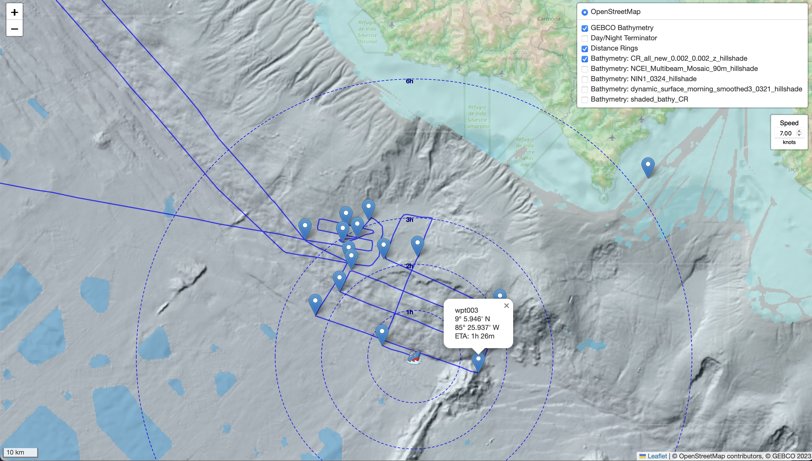

# 🛳️ ShipMap - Live Research Vessel Tracker

This is a simple Flask + Leaflet web app to visualize live ship track data from the WHOI intranet server. It fetches the latest `.xy` file from the Atlantis map service, parses it, and displays:

- 🚢 Live-updating ship track (auto-refreshes every 5 min)
- 🟢 Waypoints displayed on the map, with estimated ETA at current ship's speed
- ⭕️ Travel-time rings at current ship's speed (1,3,6 hrs, etc. depending on zoom level)
- 🌊 Optional bathymetry overlays (GEBCO 2023 WMS, plus user-added overlays)
- 🌒 Day/night terminator overlay
- 🧭 Fully self-contained — runs locally with Python

---

## 🔧 Setup Instructions

### 1. Install Python

Download from [python.org](https://www.python.org/downloads/windows/) and ensure ✅ "Add Python to PATH" is checked.

### 2. Install Dependencies

Open a terminal in this folder and run:

```bash
pip install -r requirements.txt
```

### 3. Run the App

From terminal:

```bash
python app.py
```

This will launch the Flask server, and display the IP address where the server is running, for example 1.1.1.1. Now, open your browser to http://<IP address>:5000/ . This should work from anywhere on the ship. To stop the server, just close the terminal window running the app.

For windows, see [`README-windows.txt`](README-windows.txt) for quick-start instructions. This is untested.


### Updating the layers:

*Ship track:* The ship track is pulled dynamically from the file linked in the page at http://www.atlantis.whoi.edu/cgi-bin/imet/get_tracks. This page is read by the python server, and the ship track is parsed from the file named http://www.atlantis.whoi.edu/timages/try_<number>.xy. If this page is not available (for example, if you are not on the R/V Atlantis), then a fallback file containing the track of AT50-35 is loaded from the static/ folder instead.

*Waypoints:* The file [`waypoints.txt`](waypoints.txt) contains the waypoints to be displayed on the map as location markers. The file format is `decimal_lat,decimal_lon,name`. This has to be updated manually on the computer running the python server. After updating the waypoints file, just refresh any browser window with the map in it (no need to restart the python server).

*Bathymetry:* To add a custom bathymetry layer, take any GeoTiff file (ideally, pre-rendered as a hillshade or other color image using QGIS/ArcMap/etc.) and run this gdal command (you need to have gdal installed):

`gdal2tiles.py --xyz --profile=mercator -z 6-13 input_filename.tif tiles/custom_bathymetry_layer`

The name of the folder inside the tiles/ folder can be anything you like, it will be dynamically read and displayed as an option in the layers dropdown.

The given zoom levels (6-13) generally work well for bathymetry layers but you can add higher values if you have very high-resolution images over a small area (takes a long time and generates a lot of tile images if your area is too large), or include lower values if you want to see the layer appear at global scales. When the map is zoomed to a level outside this range, the bathymetry will just disappear. 


### Example:



